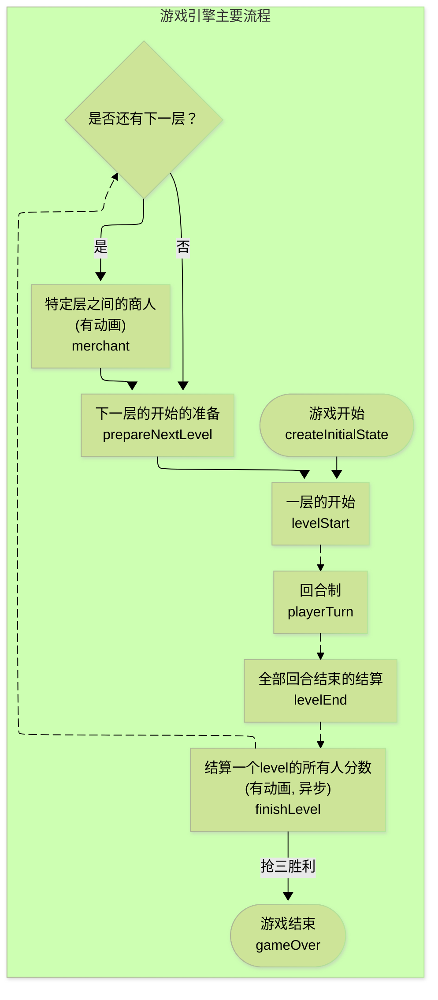
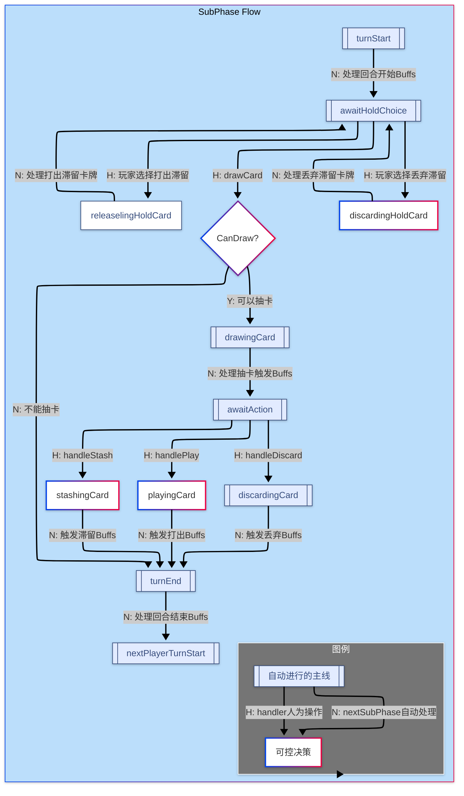

# 纯粹的抽卡决斗

## 🎯 设计目标

打造一款节奏紧凑的双人抽卡对决游戏，核心体验围绕「随机抽牌 + 分数博弈 + 小规模运营」，同时通过层级推进、旅行商人和收藏要素制造出连续的惊喜感与逆转空间。

- **AI行动动画**：AI回合采用逐步异步推进，每步有1~1.5秒随机延时，日志逐条出现，体验更流畅。
- **Buff样式优化**：Buff方块无阴影，鼠标悬浮也无阴影，玩家面板不再显示“增益”标题。
- **结算与阶段弹窗**：`finishLevel` 出现分数结算弹窗（横向柱状图 2s 上升到最终分数并标注名次），层开始显示 1s 的阶段开场弹窗；均采用 Ant Design 的 Modal。
| 层级 | 关键事件 | 玩家初始状态 | 特殊规则 |
| --- | --- | --- | --- |
| 第 2 层 | Deepening | 保留上一层滞留卡 | 开放部分进阶卡 |
| 第 2.5 层 | Traveling Merchant A | 旅行商人事件 | 可购入 1 张额外卡牌加入滞留位或背包 |
| 第 3 层 | Pivot | 背包卡可自由使用 | 引入反制性卡牌 |
| 第 4.5 层 | Traveling Merchant B | 旅行商人事件 | 商人卡可跨层携带 |
| 第 5 层 | Verdict | 最终对决 | 存在更多胜利碎片 |
- 移除所有阴影效果，悬浮时无阴影。

## 🗂️ 源码目录规划

- 移除“增益”标题，Buff区更简洁。

```text
  game/
    types.ts          // 核心类型定义与常量
    levels.ts         // 层级配置、卡池构建逻辑
    engine.ts         // 回合/结算/胜利判定的纯函数
  - 新增 `getAiTurnSteps`，AI行动每步返回一个新state，供前端逐步推进。
  - `executeAiTurnAsync` 支持 onStep 回调，前端可逐步setGameState，日志逐条出现。

    CardDisplay.tsx   // 卡牌及提示的展示组件
    PlayerHUD.tsx     // 玩家得分、滞留位、碎片信息
  - AI回合监听并逐步推进，每步setGameState，日志逐条出现。
    MerchantModal.tsx // 旅行商人事件界面

  App.tsx             // 顶层 UI，协调状态机
  App.css             // 页面排版与主题
  - Buff相关样式去除所有阴影。
  - 接入 AI 异步回合执行（1~1.5s 随机延时）。
  - 在 finishLevel 展示结算动画弹窗，levelStart 展示阶段开场弹窗。

  LevelResultModal.tsx // 新增：层结算动画（2s 柱状条动态上升+名次）
  PhaseIntroModal.tsx  // 新增：阶段开场（1s 简洁弹窗）
  AnimatedBuffList.tsx // 新增：Buff 进出场动效容器（由大变正淡入、淡出，固定容器高度）
```

- **Buff区无标题、无阴影，视觉更简洁。
- **AI行动逐步推进，日志逐条出现，体验更流畅。
  - 根据 `levels.ts` 构建并洗牌当层卡堆，生成公开信息（稀有度、胜利碎片分布）。

- AI行动日志逐条出现，延时动画效果明显
- Buff区无阴影，鼠标悬浮无阴影，“增益”标题已移除
- Buff 容器高度统一（不再因从无到有而跳动），Buff 获取时由大到正淡入、过期淡出；堆叠数量移至右上角浅灰三角角标内的白色数字，更直观。

1. **AI/对手阶段**：
   - 应用层通行证（`max(score, 50)` 等）等延迟效果。
   - 比较双方分数，记录胜负局数。
   - 检查是否触发旅行商人或比赛胜利。

2. **旅行商人阶段**（2.5 / 4.5）：
   - 提供 3 张随机精选卡（来源于下一层卡池加特殊事件卡）。
   - 玩家仅能购入 1 张，消耗当层积分赎买值（默认 10 分或一张持有卡）。
   - 购入卡可选择放入滞留位或背包（下一层开始才能使用）。

## 🃏 卡牌体系

| 分类 | 代表卡 | 效果 | 备注 |
| --- | --- | --- | --- |
| 运算卡 | 连锁加法、暴击倍增 | `add`, `multiply` | 决定主要分数走势 |
| 风险卡 | 归零试胆、负向迁移 | `reset`, `steal` | 造成高风险高收益 |
| 资源卡 | 时间扭曲、抽牌加速 | `extraDraw`, `duplicate` | 建立节奏优势 |
| 胜利碎片 | 「命运碎片」 | `victoryShard` | 收集 3 枚瞬杀 |
| 通行证 | “x层通行证” | `levelPass` | 结算时保底 50 分，可跨层携带 |
| 商人限定 | 秘密交换、护甲护盾 | `shield`, `swap` | 仅旅行商人提供 |

详细原型见 `cards.ts`，每张卡都会在实例化时生成随机数值（例如 $\pm2\sim\pm8$ 的加减幅度），并以稀有度控制出现概率。

## ⚙️ 状态机设计（已与代码同步）

- `GameState.levelPhase`（新增，关卡级主流程）:
  - `'levelStart' | 'playerTurn' | 'levelEnd' | 'finishLevel' | 'merchant' | 'prepareNextLevel' | 'gameOver'`
- `GameState.phase`（保留，回合/对局内的粗粒度阶段，向下兼容）: `'playerTurn' | 'finishRound' | 'merchant' | 'matchEnd'`
- `GameState.subPhase`：
  - `turnStart` → 回合开始，触发当前玩家 Buff 的 `onTurnStart`
  - `awaitHoldChoice` → 可释放/丢弃滞留或进入抽卡
  - `releaselingHoldCard` / `discardingHoldCard` → 正在结算/丢弃滞留牌，处理完毕自动返回 `awaitHoldChoice`
  - `drawingCard` → 进入抽卡动作（动作完成后推进到 `awaitAction`）
  - `awaitAction` → 对 activeCard 进行“结算/滞留/丢弃”
  - `turnEnd` → 触发当前玩家 Buff 的 `onTurnEnd`，并在此时统一判断是否整轮结束
  - `nextPlayerTurnStart` → 切换到下一名玩家并进入其 `turnStart`
- `GameState.level`: 1-5，半层用 `merchant` phase 标识。
- `PlayerState`：维护 `score`、`drawsUsed`、`maxDraws`、`extraDraws`、`holdSlots`（滞留栈，LIFO）、`backpack`、`victoryShards`、`wins`、`passTokens`、`buffs` 等。
- `DeckState`：`drawPile`、`discardPile`、`publicInfo`（剩余胜利碎片、稀有卡数量）。
- `LogEntry`：每次子阶段变更都会记录一条：`子阶段: from -> to`。

说明：所有数值运算通过 `engine.ts` 的纯函数完成，React 组件只负责触发动作与展示结果。

### Level Phase 状态机（新增）

为对齐 README 顶部流程图，关卡级状态机与 subPhase 采用相同的“可验证 + 推进行为”模式：

- `ensureLevelPhase(state, phase)`：校验当前是否处于指定关卡阶段，不匹配返回错误结果（不变更状态）。
- `advanceLevelPhase(state)`：将关卡阶段按主线推进一格（只处理“自动主线”环节）。
- `beginLevel(state)`：从 `levelStart` 进入 `playerTurn`，构建并洗牌当前层的卡堆、重置当层统计与公开信息。
- `finishRound(state)`：在 subPhase 判定“所有玩家均无法继续抽牌”后，推进关卡阶段至 `levelEnd`。
- `finishLevelAndJudge(state)`：在 `finishLevel` 阶段结算所有玩家分数、碎片/胜场与延迟效果（如通行证）；若已有玩家抢三则切至 `gameOver`，否则进入“是否还有下一层”的分支判定。
- `maybeMerchant(state)`：依据层数命中 2.5 / 4.5 等半层事件，切至 `merchant`；否则进入 `prepareNextLevel`。
- `prepareNextLevel(state)`：清理当层临时数据，层数 +1，回到 `levelStart`（随后 `beginLevel`）。
- `gameOver(state)`：对局结束，保留最终统计与日志。

说明：以上 API 与 subPhase 的 `ensurePhase/advanceSubPhase` 使用体验保持一致，便于在 UI/AI 层做线性驱动与断点恢复。

## 操作逻辑流程图





## 🧠 主要交互逻辑（函数与阶段对应）

- 抽牌：
  - 在 `awaitHoldChoice` 通过 `advanceSubPhase()` 进入 `drawingCard`，随后调用 `engine.drawCard()` 抽到 `activeCard`，引擎自动推进到 `awaitAction`。
- 使用当前抽到的卡（activeCard）：
  - `engine.playActiveCard()`，处理完后 UI 调用 `finishPlayerTurn()` 推进到 `turnEnd`，引擎在此统一判断整轮是否结束，若未结束则进入下一玩家回合。
- 将当前抽到的卡滞留：
  - `engine.stashActiveCard()`，随后 UI 调用 `finishPlayerTurn()` 推进回合。
- 丢弃当前抽到的卡：
  - `engine.discardActiveCard()`，随后 UI 调用 `finishPlayerTurn()` 推进回合。
- 释放/丢弃滞留牌：
  - `engine.releaseHoldCard()` / `engine.discardHoldCard()`，引擎进入 `releaselingHoldCard` / `discardingHoldCard`，处理完毕自动回到 `awaitHoldChoice`。
- 回合开始/推进：
  - `engine.beginNextPlayerTurn()`：当子阶段为 `nextPlayerTurnStart` 时切到下一玩家并置为 `turnStart`；处于 `turnStart` 会自动推进到 `awaitHoldChoice`。
- 回合结束与整轮结束：
  - UI 调用 `engine.finishPlayerTurn()` 进入 `turnEnd`；引擎在 `turnEnd` 统一判定是否进入 `finishRound`（所有玩家无法继续抽牌），否则进入 `nextPlayerTurnStart`。
- 旅行商人：
  - `engine.skipMerchant()` / `engine.acceptMerchantOffer(index)` 用于跳过或接受报价。

## 🖥️ UI 与调试（本次更新要点）

- 子阶段驱动的按钮集合：
  - `awaitHoldChoice` 显示：“释放滞留 / 丢弃滞留 / 抽卡”。
  - `awaitAction` 显示：“结算 / 滞留 / 丢弃”。
  - 其余阶段不显示会误导的操作，避免无效点击。
- 调试日志增强：
  - 每次子阶段变更都会记录一条 `子阶段: from -> to`，便于定位流程问题。
- 重置对决体验：
  - 点击“重置对决”后，会自动从 `turnStart` 推进到 `awaitHoldChoice`，无需手动多一步。
- AI 自动操作开关：
  - 顶栏新增“允许 AI 自动操作”开关。开启后，AI 在自己的回合按照与玩家一致的子阶段流程进行随机决策（释放滞留/抽卡/对 activeCard 结算/滞留/丢弃），用于便捷调试。

## 🔧 引擎 API 变化（面向前端的重要差异）

- `ensurePhase(state, phase, subPhase?)`：第三个参数可用于校验子阶段，不匹配返回错误结果。
- `advanceSubPhase(state)`：推进一个子阶段（例如将 `awaitHoldChoice` 推进到 `drawingCard`）。
- `beginNextPlayerTurn(state)`：处于 `nextPlayerTurnStart` 时切换玩家；处于 `turnStart` 时推进到 `awaitHoldChoice`。
- `finishPlayerTurn(state)`：推进到 `turnEnd` 并在此处做整轮结束判断；若未结束则进入 `nextPlayerTurnStart`（随后由 UI 调用 `beginNextPlayerTurn`）。
- `releaseHoldCard(state)` / `discardHoldCard(state)`：在 `awaitHoldChoice` 下进入对应处理子阶段，完成后回到 `awaitHoldChoice`。
- `playActiveCard` / `stashActiveCard` / `discardActiveCard`：在 `awaitAction` 下对当前抽到的卡进行操作。

### 关卡级 API（新增）

- `ensureLevelPhase(state, phase)`：校验关卡阶段。
- `advanceLevelPhase(state)`：自动推进一个关卡阶段（只含主线节点）。
- `beginLevel(state)`：根据 `levels.ts` 构建当前层卡堆、公开信息，并切入 `playerTurn`。
- `finishRound(state)`：当 subPhase 判定“整轮结束”时调用，将 `levelPhase` 切到 `levelEnd`。
- `finishLevelAndJudge(state)`：执行分数与胜场判定，可能进入 `gameOver` 或 `merchant/prepareNextLevel`。
- `skipMerchant(state)` / `acceptMerchantOffer(index)`：半层事件中的交互（沿用原有 API）。

## 🛠️ 技术实现规划

1. **数据层**：先完成 `types.ts`、`cards.ts`、`levels.ts` 与 `engine.ts`，确保可通过单元测试验证核心逻辑。
2. **UI 层**：
   - 顶部：层级/胜场/碎片概览。
   - 中部：双方面板 + 日志。
   - 底部：操作面板（抽牌、使用、滞留位控制、结束回合）。
   - 弹窗：旅行商人与关键事件。
3. **AI 策略**：简单优先级 + 随机因素，逐步可调。
4. **测试**：计划加入 `vitest` 针对 `engine.ts` 的纯函数测试（后续迭代完成）。

## 🚀 开发里程碑

- [x] 设计文档与目录规划
- [x] 关卡级状态机文档与 API 约定（本次更新）
- [ ] 核心引擎函数
- [ ] UI 组件与交互
- [ ] 旅行商人事件
- [ ] AI 策略调优
- [ ] 自动化测试覆盖

随后章节将由代码实现同步推进，本存储库 README 将在主要里程碑后更新。

## BUG反馈以及优化建议

### 第一期

1. 玩家操作引导有点弱, 用户不清楚当前可以操作什么, 请改为会有波纹的按钮(轻量动效), 以及鼠标悬浮时的气泡提示(antd组件), 如果回合中可以动的操作全部没有了, 对"结束回合"按钮进行高亮提示.
2. 事件日志有些单调了, 而且超过十位数之后, 十位数会被遮挡, 这个计数可以替换成secondary的颜色; 此外, 最新的日志出现的时候, 背景做一个灰色的闪烁, 然后保持淡灰色(表示这是最新的事件), 注意轻量化实现, 日志的高度做一个限制(只显示3行)
3. 日志中如果提到了卡牌, 应当给一个特别的圆角背景色块, 以及鼠标悬浮时的气泡提示(显示的是卡牌的详细信息)
4. 待处理的卡牌和滞留位改为卡牌位放在玩家操作的下面, 卡牌应当是竖着的矩形, 最左侧是牌叠(展示牌背), 右侧是刚抽到的牌, 再右侧有一个居中的竖着的虚线, 然后依次是滞留的牌(给两个槽位), 虚线框表示滞留位(比牌大一点点)
5. 抽牌给一个轻量的动画, 牌从上淡入抽牌位置, 存入滞留位时, 牌从抽牌位置移动到滞留位(自动判断空位), 如果使用(包括滞留位), 则向上淡出; 丢弃时, 牌向下淡出

### 第二期

1. **玩家操作按钮优化**
   - **引导动效**: 将当前可操作按钮的动效从“点击波纹”改为“持续脉冲/闪烁”，以主动提示玩家当前可执行的操作。
   - **悬浮效果**: 移除按钮在鼠标悬浮时的阴影效果，保持扁平化（Flat）设计风格。

2. **滞留位机制与交互调整**
   - **栈式结构**: 滞留位（Hold Slots）应调整为 LIFO（后进先出）的栈结构，允许两张牌。
   - **使用规则**: 玩家只能使用最新放入（最前端）的滞留卡。
   - **动画与状态**:
       *存入新卡时，所有已滞留的卡牌向后移动一个位置。
     - 使用滞留卡后，其后的卡牌向前递补。
   - **按钮逻辑**: “滞留”按钮仅在滞留区有空位时才可点击。

3. **卡牌展示与信息层级优化**
   - **牌面信息**: 将完整的卡牌效果描述直接展示在牌面上，而非仅在 Tooltip 中。效果描述区域应使用色块衬底以突出。若描述过长，则截断并在悬浮时通过 Tooltip 显示全文。
   - **操作按钮分离**: 移除卡牌上的“释放滞留卡”按钮，统一移至玩家主操作区。
   - **稀有度展示**:
       *在卡牌顶部增加一个与稀有度颜色对应的横条（如：灰色代表普通），取代居中文字。稀有度名称可作为小字印在横条上。
     - 卡牌名称使用带颜色的背景块和反色文字（如白字）进行高亮。
   - **信息字段**: 卡牌数据结构应区分 `description`（牌面完整描述）和 `keywords`（用于 Tooltip 中展示的额外补充词条）。
   - **Tooltip 样式**: 自定义 Tooltip 样式，改为白色背景、黑色文字，以提升可读性。

4. **旅行商人机制与视觉升级**
   - **视觉强化**:
     - 商人提供的“强化项”应有独特视觉，区别于普通卡牌（如使用深绿色底），并增加内衬线和随稀有度变化的边框花纹，提升品质感。
   - **代价机制**:
       *将购买方式从“消耗当层分数”改为“付出代价”。
     - 强化项的展示分为上下两部分：上半部分为“增益效果”，下半部分为“付出代价”。
     - 代价的类型和强度应与强化项的稀有度挂钩。例如，稀有度越高，效果越强，但代价也越大（如“下一轮少抽一张牌”、“起始分数降低”等）。每次商人事件随机生成增益与代价组合。

5. **事件日志功能完善**
   - **滚动与历史**: 日志区域高度固定为显示 3 条，但需保留全部历史日志。当新日志产生时，自动滚动到底部。增加滚动条，允许玩家向上翻阅历史记录。

### 第三期

  1. **抽卡按钮与动效优化**
    - **状态显示**: 抽卡按钮文案改为 “抽卡 \[已抽/总数]”，实时反映抽卡进度。
    - **禁用状态**: 当抽卡次数用尽时，按钮自动进入禁用（Disabled）状态。
    - **动效增强**: 提升可操作按钮的脉冲动效频率，增强视觉引导。

  2. **Buff 系统重构**
    - **统一概念**: 将胜利碎片、防御盾、通行证等状态统一为 “Buff” 系统管理。
    - **视觉呈现**:
      - Buff 在专属区域内以带图标的方块展示，支持横向滚动。
      - 鼠标悬浮时，通过 Tooltip 显示该 Buff 的完整信息（名称、描述、效果、持续性等）。
    - **类型区分**:
      - **临时 Buff**: 仅当前回合有效的 Buff，在其右下角增加一个金色三角角标作为标识。
      - **永久 Buff**: 无特殊角标。
    - **堆叠机制**: 相同类型的 Buff 会自动合并，并在图标右上角显示堆叠数量（如：胜利碎片 x2）。
    - **逻辑集成**: 重构所有原有的状态增减逻辑（如获取胜利碎片、施加护盾），全部通过增删 Buff 来实现。
    - **图标资源**: Buff 图标统一从 `/assets/svg/` 目录加载。

### 第四期

  1. **回合制与阶段流程**
    - **多玩家支持**: 游戏状态中的玩家应为数组结构（`players: []`），以支持多人对战。操作面板根据当前行动玩家动态更新。
    - **共享卡池**: 所有玩家共用同一个抽牌堆和弃牌堆。
    - **回合阶段定义**:
  1. **回合开始阶段 (Turn Start)**: 触发当前玩家身上所有 Buff 的 `onTurnStart` 效果。
  1. **滞留卡使用阶段 (Hold Phase)**: 玩家可选择使用任意数量的滞留卡。若无滞留卡，则跳过此阶段。
  1. **抽卡与行动阶段 (Draw & Action Phase)**:
        - 玩家执行抽卡。若无抽卡次数，则跳过此阶段并给出提示。
        - 对抽到的卡，玩家可选择 **使用**、**滞留** 或 **丢弃**。选择 **滞留** 将直接结束当前玩家的行动。
  1. **回合结束阶段 (Turn End)**: 触发当前玩家身上所有 Buff 的 `onTurnEnd` 效果，随后轮到下一位玩家。

  1. **Buff 效果扩展**
    - **阶段触发器**: 为 Buff 的数据结构（Interface）增加 `onTurnStart` 和 `onTurnEnd` 等回调函数字段，用于在回合不同阶段自动触发效果。
    - **数值修饰器**: 为 Buff 增加数值处理函数字段，用于在卡牌结算时动态修改效果数值。例如：
      - **基础值修改**: `(value) => value + 5`（如：每次得分额外+5）
      - **倍率修改**: `(multiplier) => multiplier * 2`（如：得分翻倍）

### 第五期

1. AI操作的延迟实现, 目前AI的操作是瞬间完成的, 需要改为有延迟的(1~1.5s), 让玩家可以看到AI的每一步操作, 包括抽卡, 使用卡牌, 丢弃卡牌等. 此外, 有个BUG就是在awaitHoldChoice阶段, AI如果无卡可抽取, 应当直接选择结束回合, 而不是停在那里不动.
2. 在finishLevel的LevelPhase引入分数结算动画, 开一个悬浮窗, ANTD的module, 横着排列每个玩家, 用柱状图的不断上升表现分数高低, 最后停在最终分数位置, 并且标注胜负关系(排名). 动画时间控制在2~3秒内完成. 结束后自动关闭悬浮窗, 进入下一个阶段.一个阶段开始也给一个module动画, 表示层级和当前层级的名字, 动画简单, 而且要快一点(1秒内完成).
3. 小bug, 获取到Buff时, 玩家面板会被撑高, (因为和No Buff高度不一致), 需要统一高度, 建议和No Buff时的高度一致, 这样界面就不会跳动了.此外, 获取到Buff给一个由大缩小的淡入动画, 增强获得感. Buff消失过期的时候, 给一个淡出动画.然后层叠数量不要用小红点(看着难受), 可以标记在右上角, 用白色数字标记在Buff图标的右上角, 这样更直观一些, 给一个浅灰色的三角形衬底(右下角的角标做的很好, 参考这个设计)

#### 第五期落地（已完成）

- AI 行为改为逐步异步执行，单步延时 1~1.5s；并修复了 `awaitHoldChoice` 无法抽卡时的卡死，AI 会自动结束回合。
- `finishLevel` 引入分数结算动画（AntD Modal）：横向柱状 2s 平滑上升，显示最终分数与名次；动画结束自动关闭并进入下一阶段。
- 层开始增加阶段开场弹窗（1s）。
- Buff 区统一高度；Buff 获取时“由大到正”的淡入动画、消失时淡出；堆叠数量移至右上角浅灰色三角角标，白色数字标注；去除所有阴影。

变更的关键文件：

- `src/App.tsx`：AI 异步执行器、结算与阶段开场弹窗时序接入。
- `src/components/LevelResultModal.tsx`（新增）
- `src/components/PhaseIntroModal.tsx`（新增）
- `src/components/AnimatedBuf   fList.tsx`（新增）
- `src/components/BuffDisplay.tsx` / `BuffDisplay.css`：堆叠角标与进出场动效；无阴影。
- `src/components/PlayerHUD.tsx`：使用 AnimatedBuffList，去除“增益/No Buff”文案，稳定容器高度。

### 第六期

1. 使用完的buff应当消失, 目前是还在占位置, 只是不显示, 且同类型的buff需要合并
2. 商人的奖励应当是buff而非卡牌, 开局扣分意义也不大, 现在开始内容设计. 

商人奖励设计:
|Buff/Debuff|效果|稀有度|
|---|---|---|
|时间扭曲|下一层每次抽卡额外+1次抽卡|普通|
|能量护盾|累3个持久盾|普通|
|胜利碎片|获得1个胜利碎片|普通|

## COPILOT 开发记录与上下文（用于后续迭代）

### 第五期迭代（2025-10-17）

1. 文档与上下文

- 新增“Level Phase 状态机”与“关卡级 API”章节，定义 `GameState.levelPhase` 及其流转：`levelStart → playerTurn → levelEnd → finishLevel → (merchant|prepareNextLevel) → levelStart | gameOver`。
- 对齐主流程 Mermaid 图节点文案，显式标注 `merchant` 与 `prepareNextLevel`。
- 与 subPhase 的 `ensure/advance` 模式保持一致，便于前端与 AI 复用驱动方式。

1. 后续落地（计划）

- 在 `engine.ts` 实装 `ensureLevelPhase/advanceLevelPhase/beginLevel/finishLevelAndJudge/maybeMerchant/prepareNextLevel`。
- 在回合收尾处（`finishPlayerTurn` 的整轮结束分支）调用 `finishRound → levelEnd → finishLevelAndJudge`。
- `App.tsx` 根据 `state.levelPhase` 切换展示：玩家回合、结算动画、商人弹窗、下一层准备。

1. 兼容性

- 保留现有 `GameState.phase`（`'playerTurn' | 'finishRound' | 'merchant' | 'matchEnd'`）以平滑迁移；UI 可优先读取 `levelPhase`，回退到 `phase`。

### 第四期迭代（2025-10-16）

1. **核心改动**

    - **多玩家支持**：`GameState` 结构调整为 `players: PlayerState[]`，并新增 `currentPlayerIndex`，所有操作均基于当前行动玩家。
    - **阶段流程**：实现了回合开始、滞留卡使用、抽卡与行动、回合结束的阶段流转，并支持 Buff 的 `onTurnStart`/`onTurnEnd` 自动触发。
    - **Buff 扩展**：`PlayerBuff` 接口新增阶段触发器和数值修饰器字段，便于后续 Buff 效果扩展。
    - **逻辑迁移**：原有 player/ai 相关逻辑全部迁移至多玩家数组结构，兼容共享卡池。
    - **前端适配**：`App.tsx`、`PlayerHUD`、`CardLane` 等组件均已接入 players 数组，操作面板随当前行动玩家动态切换。

1. **主要文件变更**

    - `src/game/types.ts`：重构 `PlayerState`、`PlayerBuff`、`GameState`，加入阶段触发与数值修饰定义。
    - `src/game/engine.ts`：全面改写为面向 `players` 数组的实现，补齐 Buff 触发、回合交接与商人阶段的控制权切换。
    - `src/App.tsx`：完成前端交互迁移，移除旧的 `player`/`ai` 访问路径。

1. **测试与验证**

    - 多玩家回合交替（玩家→AI）顺利推进，Buff 在回合起止阶段正常触发。
    - 抽卡、滞留、结算、结束回合等操作均无异常。
    - 与既有单/双人逻辑向下兼容。

1. **建议的下一步**

    - 丰富 Buff 效果与动画表现。
    - 探索更多玩家数量与自定义房间配置。
    - 在 UI 层面补充阶段提示与回合流引导。

---

```markdown
目的：记录最近迭代的核心改动，便于后续继续实现和排查。

### 第三期迭代 (2025-10-16)

1) 核心改动
- **抽卡按钮优化**：按钮文字显示为"抽卡 [已抽/总数]"，当抽完所有次数后按钮自动禁用。
- **动效频率提升**：将按钮脉冲动画频率从 2s 提高到 1.2s，增强视觉提示。
- **Buff 系统重构**：将原有的胜利碎片、防御盾、通行证等分散数据统一为 Buff 系统管理。

2) 新增/修改的文件
- `src/components/BuffDisplay.tsx` (新增)
  - 独立的 Buff 展示组件，支持图标、数量角标、临时 Buff 金色三角标识。
  - 鼠标悬浮显示 Buff 详细信息（名称、描述、效果类型、数值）。
  
- `src/components/BuffDisplay.css` (新增)
  - Buff 方块样式（48x48px）、临时 Buff 金色角标样式。
  - 横向滚动列表支持，带自定义滚动条样式。
  
- `src/components/PlayerHUD.tsx`
  - 重构为从 PlayerState 动态生成 Buff 列表。
  - 支持的 Buff 类型：胜利碎片、防御盾、额外抽卡（临时）、层通行证、商人代币、待处理惩罚（临时）。
  - 相同类型 Buff 自动合并并显示堆叠数量。
  
- `src/game/types.ts`
  - 扩展 `PlayerBuff` 接口：新增 `icon`（图标路径）、`isPermanent`（是否永久）、`count`（堆叠数量）字段。
  
- `src/game/engine.ts`
  - 在 `createInitialState` 中为 player 和 ai 初始化 `buffs: []` 字段。
  - 在 `clonePlayer` 中添加对 `buffs` 的深拷贝。
  
- `src/App.tsx`
  - 抽卡按钮文字改为动态显示：`抽卡 [${已抽}/${总数}]`。
  - 当抽完所有次数后，按钮自动禁用（通过 `drawsRemaining <= 0` 判断）。
  
- `src/App.css`
  - 调整 `.btn--glow` 动画周期从 2s 到 1.2s。
  - 增加 `@keyframes btn-glow` 的效果强度（box-shadow 从 6px/0.15 提升到 8px/0.25）。
  - 新增 `.player-hud__buffs` 样式区域，支持标题和横向滚动列表。

3) Buff 系统实现细节
- **图标路径**：使用 `/src/assets/svg/` 目录下的 SVG 图标（如拼图_puzzle.svg 表示胜利碎片）。
- **堆叠逻辑**：相同类型的 Buff（通过 `id` 区分）会合并为一个，右上角显示数量角标。
- **临时标识**：`isPermanent: false` 的 Buff 会在右下角显示金色三角标识，表示仅当前回合有效。
- **Tooltip 内容**：使用 Ant Design 的 Tooltip，自定义 `tooltip-light` 样式（白底黑字）。

4) 测试与验证
- `npm run build` ✅ 构建成功
- 动效频率提升明显可见
- Buff 显示区域支持横向滚动，超过区域后可滚动查看
- 临时 Buff 的金色三角角标正常显示

5) 建议的下一步
- 补充实际游戏逻辑中对 Buff 系统的应用（如结算时检查 Buff 效果）。
- 为 Buff 系统增加动画效果（获得/失去 Buff 时的淡入淡出）。
- 考虑添加 Buff 的排序逻辑（如按稀有度或临时/永久分组）。
- 完善 AI 的 Buff 使用策略。

---

### 第二期迭代

1) 高层概要
- 聚焦 UI 视觉统一：顶栏提示合并、卡牌牌面重绘、旅行商人报价体验强化。
- 维持第二期提出的交互规则（按钮脉冲、双槽滞留、日志 3 条窗口）。

2) 已修改 / 新增的文件
- src/App.tsx / src/App.css
  - 将全局提示行（卡堆剩余、阶段提示、胜利文案）内联到标题区，基于 Ant Design Space 布局。
  - 新增卡牌稀有度配色变量、固定牌面尺寸与装饰伪元素。
- src/components/CardDisplay.tsx
  - 重构卡牌结构：顶部稀有度色带 + 稀有度标签、圆角衬底卡名、主描述正文。
  - 去除默认 Card padding，接入稀有度主题颜色与修饰伪元素。
- src/components/MerchantModal.tsx / MerchantModal.less (若存在)
  - 增益/代价区域复用卡牌展示组件，上下分区，中线分隔并应用独立装饰风格。
- src/components/CardLane.tsx
  - 适配新的固定尺寸牌面，确保抽牌/滞留动画坐标一致。

3) 关键实现细节
- 稀有度主题通过 CSS 变量集中定义（normal/rare/epic/legend），同时驱动卡面底色、顶部色带、伪元素纹理。
- 使用 `.ant-card-body { padding: 0; }` 等定向覆写消除默认留白，使稀有度色带贴顶。
- 卡牌内容区采用 flex-column，描述正文有浅色衬底并支持 Tooltip 展示完整文本（逻辑沿用前一迭代）。
- 商人报价：增益与代价均为 CardDisplay 渲染，外层容器根据条目稀有度切换暗绿色底与边框花纹。

4) 运行与验证
- `npm run build` ✅
- 手动检查：顶栏提示与标题同行展示正确；不同稀有度卡牌视觉差异正常；商人商品上下结构与代价区使用同一组件、装饰独立。

5) 建议的下一步
- 将稀有度主题抽成独立样式模块，便于未来动态切换皮肤。
- 考虑为卡牌描述正文添加多语言 key，方便本地化。
- MerchantModal 可扩展动画或声音提示以强化购买决策反馈。

以上为历次迭代上下文，供后续开发参考。
```
